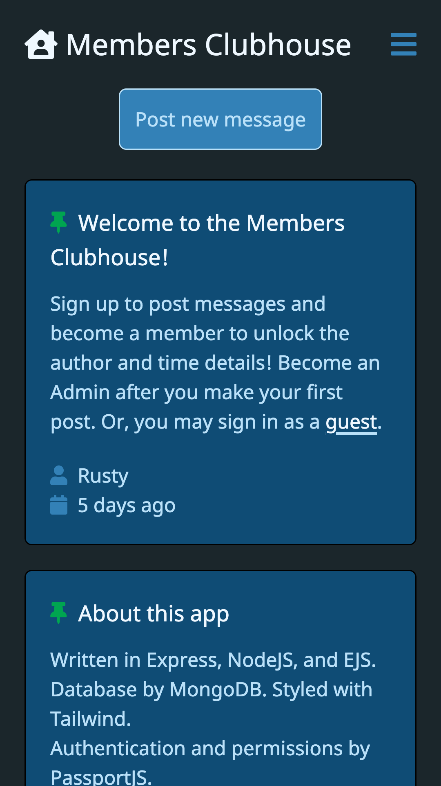
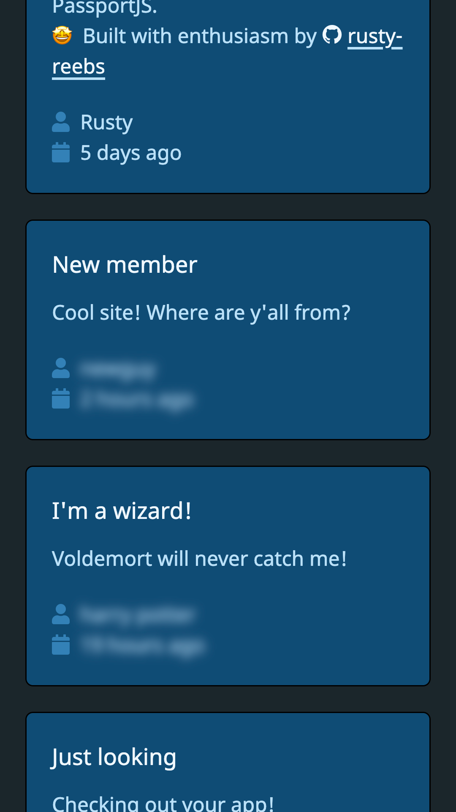
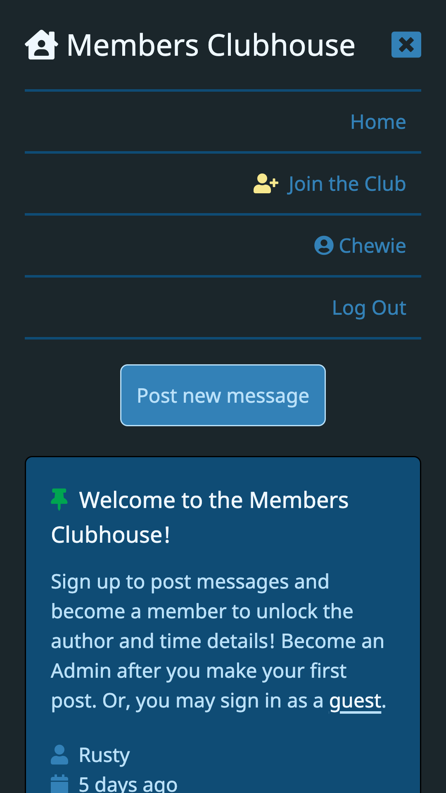

# Members Clubhouse authentication app 👥

&nbsp;&nbsp;&nbsp;&nbsp;  

Date completed: February 5, 2022  

**Optimized for 📱 mobile and 🖥 desktop!**  

**See it live at (https://clubhouse-rusty-reebs.herokuapp.com)**  

Objectives: Build a message board Express app with authentication/security technologies such as PassportJS, localStrategy, express-session, bcryptJS, and `.env` files. Users should be required to sign in before seeing all of the content.

### Screenshots
----

&nbsp;&nbsp;&nbsp;&nbsp;  

### TIL Things I Learned
----

- how to develop an Express app featuring common authentication technologies like PassportJS, express-session, and localStrategy.
- used Tailwind CSS for the first time and was very impressed with its ease of use!
